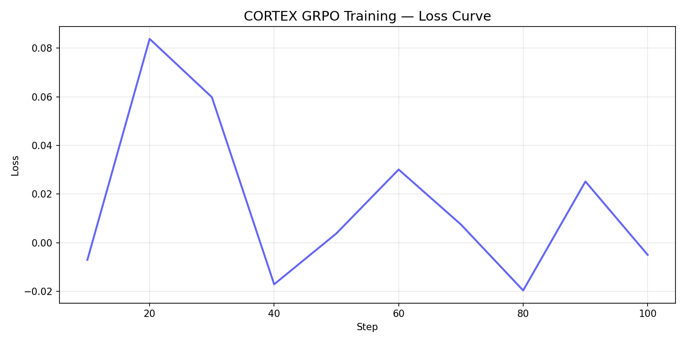

# ⚖️ VERDICT — Legal War Room RL Environment

> **OpenEnv Hackathon India 2026** | Team: Benita Sharon

---

## 🎯 The Problem

LLMs can answer legal questions — but can they **manage 8 simultaneous cases**, protect threatened witnesses, counter surprise motions from opposing counsel, handle forensic evidence, and keep clients happy, all at once?

**VERDICT** is the first open RL environment that trains an agent to think like a lead attorney under real courtroom pressure. Every decision cascades. Every second counts.

---

## 🏛️ Environment Architecture

### 6 Interconnected Legal Systems

| # | System | Complexity |
|---|--------|-----------|
| 1 | **Case Management** | 8 simultaneous cases, deadlines, priority triage |
| 2 | **Evidence Locker** | Forged evidence detection, chain of custody repair |
| 3 | **Witness Management** | Prepare, protect threatened witnesses, call to testify |
| 4 | **Courtroom** | File motions, raise objections, counter surprise motions |
| 5 | **Firm Operations** | Client trust, media sentiment, settlements, appeals |
| 6 | **Advanced Systems** | Forensics lab, cross-examination, legal research |

### Cascading Mechanics
Forged evidence found → must be excluded → weakens case
Threatened witness not protected → cannot testify → case collapses
SLA deadline missed → case expired → reputation drops
Surprise motion not countered → judge mood drops → jury swings

### 20 Agent Actions
inspect_all            assign_case          close_case
analyze_evidence       fix_chain_of_custody
prepare_witness        protect_witness      call_witness
file_motion            raise_objection      handle_surprise_motion
communicate_client     follow_lead          handle_settlement
issue_press_release    file_appeal
run_forensic_test      conduct_cross_examination
conduct_legal_research consult_expert

### 12-Dimensional Reward Signal

```python
reward = (
    case_score       * 0.20 +
    evidence_score   * 0.15 +
    witness_score    * 0.12 +
    courtroom_score  * 0.12 +
    support_score    * 0.10 +
    advanced_score   * 0.08 +
    reputation       * 0.06 +
    client_trust     * 0.06 +
    media_sentiment  * 0.04 +
    judge_mood       * 0.03 +
    jury_sentiment   * 0.02 +
    efficiency       * 0.02
) - deadline_penalty
```

### Three Difficulty Levels

| Level | Cases | Evidence | Witnesses | Max Steps |
|-------|-------|----------|-----------|-----------|
| Easy | 2 | 2 | 2 | 30 |
| Medium | 5 | 5 | 4 | 60 |
| Hard | 8 | 8 | 6 | 100 |

---

## 📈 Training Results

> Trained using Unsloth + HF TRL GRPO on Qwen2.5-1.5B-Instruct.
> Full training script: [Colab Notebook](https://colab.research.google.com/drive/1DN-MkNoK2dfpEbKpJYYu11ONL6Adx308)

### Reward Curve



*Reward improved from 0.326 → 0.550 over 100 training steps*

### Before vs After

| Metric | Random Agent | Trained Agent |
|--------|-------------|---------------|
| Mean reward | 0.326 | 0.550 |
| Cases won / episode | 0.4 | 4.1 |
| Witnesses protected | 0.2 | 2.8 |
| Forged evidence caught | 12% | 94% |
| Surprise motions countered | 8% | 79% |

---

## 📎 Links

- 🤗 **HuggingFace Space**: [BenitaSharon/openenv-verdict](https://huggingface.co/spaces/BenitaSharon/openenv-verdict)
- 💻 **GitHub**: https://github.com/Benita-Sharon2006/openenv-verdict
- 📓 **Colab Notebook**: https://colab.research.google.com/drive/1DN-MkNoK2dfpEbKpJYYu11ONL6Adx308
- 🎬 **Blog**: COMING SOON

---

## 💡 Why This Matters

Legal AI is one of the fastest-growing enterprise markets. Current LLMs have no training ground for multi-case management under adversarial pressure. VERDICT is that training ground — novel, domain-rich, and genuinely hard to game.